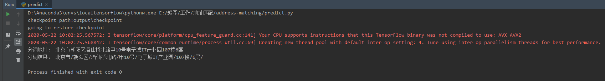
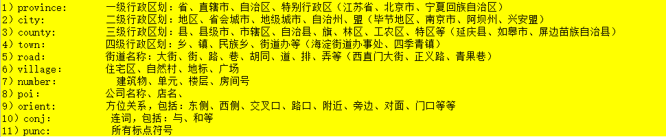
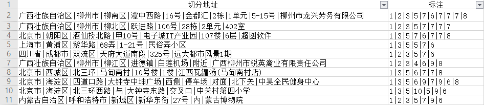

# 地址分词
网络的发展使得地址数量指数级增长，海量的数据对多个行业都提出了挑战。此项目旨在提供一个基于深度学习的地址分词器，使用监督学习的方式、BERT+BiLSTM+CRF技术，从语义角度对地址进行分词。

---
## 下载与安装
Windows：
- ~~Clone代码（目前github只有代码，模型文件太大，为了方便性，暂时不采取这种方式）~~
- IDE打开（推荐Pycharm）
- 安装必须的package

---
## 项目结构

---

## 如何运行代码，对地址分词
目前版本支持对单条地址、excel系列文件（xlsx、csv等）进行分词。根目录下的predict.py主方法中有两段代码，可以根据注释提示运行
- 单条地址分词
    - 直接运行根目录下的predict.py,就可以得到结果,结果如下
    
- 对文件中的所有地址进行分词
    - 注释掉根目录下的predict.py中 *预测单个文件代码块* ，打开 *预测整个文件代码块* ，运行predict.py
## 如何使用自己的数据训练模型
### 概述
目前项目版本使用监督学习方法，为了保证标签的准确性，我们挑选了不同省份、不同特色的1000多条手工标注的地址进行模型训练。我们将地址分为如下11个地址要素：

其次按照规定的层级对地址进行打标签操作，如下图：

有了带标签的数据，结合Google发布的BERT预训练语言模型，就可以构建自己的网络，从而训练自己的模型。

### 制作数据集
深度学习中数据的质量对最终的效果有非常大的影响。除了概述中提到的纯手动打标签的方式。

目前比较推荐的方式是：先使用训练好的模型对要训练的数据进行一次分词，人工对得到的结果进行部分检查以及修正，再进行训练。
原始数据标签文件参考 **data/sample_files/手工标记好的示例地址.xlsx**。

最后使用**other/preprocessing.py**中的主方法，生成最终的数据集。作为示例，已经使用**data/sample_files/手工标记好的示例地址.xlsx**生成了最终要使用的数据集，位于**data/dataset**下的dev.txt、test.txt、train.txt。
该示例中，将所有地址切分成三部分，训练集、测试集以及验证集，占比分别为：60%、20%以及20%

### 超参数调整
训练用到的所有超参数都在 **train/helper.py** 文件中指定，请留意有中文注释的代码，我们挑选了10个常用超参数，可以对其进行修改。
### 训练
准备好了数据集、调好了超参数，直接运行**train.py**，模型就会在**train/helper.py**中指定的output_dir中生成。

到此，训练结束。

---
## 后记
- 后期代码维护以及升级后，可以直接在[github](https://github.com/SuperMap/address-matching)上拉代码。

## 引用
>https://github.com/macanv/BERT-BiLSTM-CRF-NER